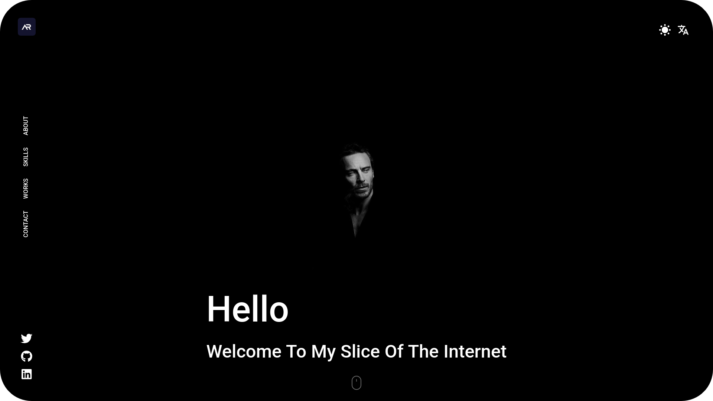
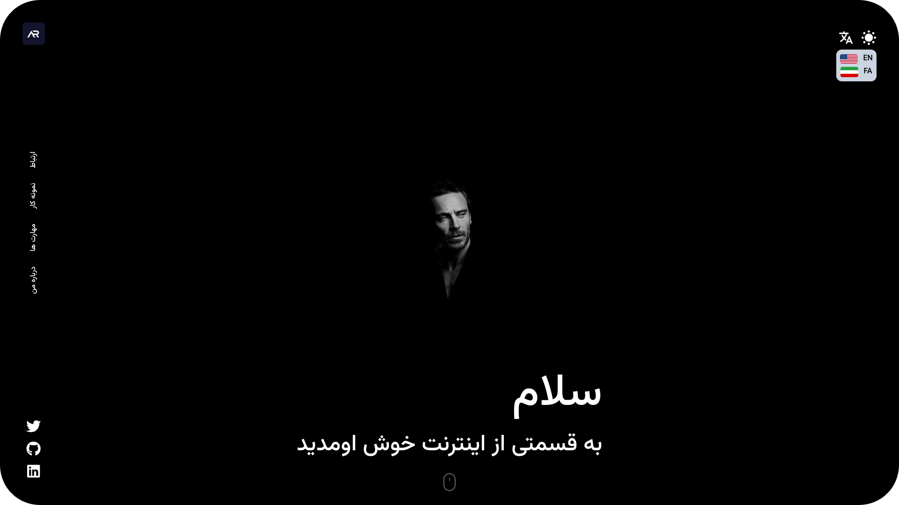

<h1 align="center"> Multilingual React.JS Portfolio Website </h1>

<p align="center"> Classic Portfolio Website </p>

- Multi Language
- Toggle For Dark & Light Theme
- Custom Style For Each Language
- Classic Design & Responsive Full

<p align="center">
    
    
    
    
    
</p>


##  Demo
- [Live demo](https://amirrahemi-portfolio.vercel.app/)

##  Screenshots
<div>
  
</div>
<div>
  
</div>

##  How To Run

### Project Download
```bash
# Clone Repository
$ git clone https://github.com/amirrahemi01/portfolio.git
```

```bash
# Open Directory
$ cd portfolio
```

### NPM
```bash
# Install dependencies & Run App
$ npm i && npm start
```

##  How To Use EMAIL.JS Contact Form

In "ContactUs.tsx" component, replace your custom service id, template id & public key :)


```bash
  .sendForm('YOUR_SERVICE_ID', 'YOUR_TEMPLATE_ID', form.current, {
    publicKey: 'YOUR_PUBLIC_KEY',
  })
```

## License

This project is licensed under the MIT License. See the [LICENSE](LICENSE.txt) file for more details.

## Stargazers over time

[](https://starchart.cc/amirrahemi01/portfolio)